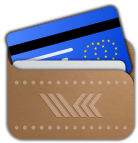

<picture>
  
</picture>
&nbsp;&nbsp;&nbsp;&nbsp;
<picture>
  <source media="(prefers-color-scheme: dark)" srcset="assets/valera-w.png">
  <source media="(prefers-color-scheme: light)" srcset="assets/valera-b.png">
  
</picture>

# Valera – VC-K-powered CMP Identity Wallet App for iOS and Android

[![Powered by VC-K](https://img.shields.io/badge/VC--K-powered-8A2BE2?logo=data%3Aimage%2Fsvg%2Bxml%3Bbase64%2CPHN2ZyB4bWxucz0iaHR0cDovL3d3dy53My5vcmcvMjAwMC9zdmciIHZpZXdCb3g9IjAgMCA4LjAzIDkuNSI+PGcgZmlsbD0iIzhhMmJlMiIgZm9udC1mYW1pbHk9IlZBTE9SQU5UIiBmb250LXNpemU9IjEyLjciIHRleHQtYW5jaG9yPSJtaWRkbGUiPjxwYXRoIGQ9Ik01OS42NCAyMjIuMTNxMC0uOTguMzYtMS44Mi4zNy0uODQuOTgtMS40Ni42Mi0uNjIgMS40Ni0uOTYuODMtLjM2IDEuOC0uMzUgMS4wMy4wMiAxLjkuNDIuODcuNCAxLjUgMS4xMi4wNC4wNS4wMy4xMSAwIC4wNy0uMDUuMWwtMSAuODZxLS4wNi4wMy0uMTIuMDN0LS4xLS4wNnEtLjQyLS40OC0xLS43Ni0uNTYtLjMtMS4yMi0uMjgtLjYuMDEtMS4xMy4yNy0uNTQuMjQtLjkzLjY3LS40LjQyLS42Mi45OC0uMjMuNTYtLjIzIDEuMiAwIC42My4yNCAxLjE4LjI0LjU2LjY1Ljk4LjQuNDIuOTQuNjYuNTMuMjMgMS4xNC4yMy42My0uMDEgMS4yLS4zLjU1LS4yNy45Ni0uNzUuMDQtLjA1LjEtLjA1LjA2LS4wMi4xMS4wM2wxIC44NnEuMDYuMDMuMDYuMS4wMS4wNi0uMDMuMTEtLjY0LjczLTEuNTMgMS4xNC0uOS40MS0xLjk1LjQtLjk1IDAtMS43OS0uMzYtLjgyLS4zNy0xLjQzLS45OS0uNjEtLjYzLS45NS0xLjQ4LS4zNS0uODUtLjM1LTEuODN6IiBzdHlsZT0iLWlua3NjYXBlLWZvbnQtc3BlY2lmaWNhdGlvbjpWQUxPUkFOVDt0ZXh0LWFsaWduOmNlbnRlciIgdHJhbnNmb3JtPSJ0cmFuc2xhdGUoLTU5LjY0IC0yMTcuNDIpIi8+PHBhdGggZD0iTTY2LjIxIDIyMS4zNWgxLjNjLjEgMCAuMTYuMDYuMTYuMTd2MS4zOGMwIC4xMS0uMDUuMTctLjE2LjE3aC0xLjNjLS4xIDAtLjE2LS4wNi0uMTYtLjE3di0xLjM4YzAtLjExLjA1LS4xNy4xNi0uMTd6IiBsZXR0ZXItc3BhY2luZz0iLTMuMTIiIHN0eWxlPSItaW5rc2NhcGUtZm9udC1zcGVjaWZpY2F0aW9uOlZBTE9SQU5UO3RleHQtYWxpZ246Y2VudGVyIiB0cmFuc2Zvcm09InRyYW5zbGF0ZSgtNTkuNjQgLTIxNy40MikiLz48L2c+PC9zdmc+&logoColor=white&labelColor=white)](https://github.com/a-sit-plus/vck)

This [Compose Multiplatform](https://www.jetbrains.com/lp/compose-multiplatform/) app implements an Identity Wallet for iOS and Android, using [VC-K](https://github.com/a-sit-plus/vck) to load, store and present verifiable credentials.

Valera seeks to comply with the emerging eIDAS2 technical specification, the regulation itself is still a very much moving target when it comes to technical details.
Still, it is already possible to interop with the EU reference issuing service and EU verifier.
 
Valera does not aim to be production-ready, but should rather be considered a testbed, allowing you to already experience
what an [EU digital identity wallet](https://github.com/eu-digital-identity-wallet) (EUDIW) application can look and feel like.

## Features

Currently, Valera can be used to fetch credentials from [wallet.a-sit.at](https://wallet.a-sit.at/m5/) in various formats
even beyond what is targeted by the upcoming EUDIW.
 
To explore verifiable presentation in all its glory (and technical details), check out our [demo service provider](https://apps.egiz.gv.at/customverifier/#),
to present previously provisioned credentials.
This demo service allows for freely defining how and which details of a verifiable credentials are requested for presentation.

Currently, the following credentials are supported:
* e-Prescription
* mDL 
* PID 
* IDA Credential
* Power of Representation (PoR)
* Certificate of Residence (CoR)

Presentation type can be either SD-JWT  or ISO mDoc.
 
For more details on these credentials, head over to our [credentials collection repo](https://github.com/a-sit-plus/credential-collection)!

## Design Principles
Valera is designed with distinctly different goals in mind than the EU reference implementation.
Most prominently, we follow a KMP-first approach. In a nutshell, this means that given the choice between
using two platform-native libraries and glue code to get a job done and investing the blood, sweat and tears it takes to
conceive a proper KMP solution, we go the distance and invest in the KMP solution.

In the end, this (at times) tiresome approach brings a couple of advantages to the table:
* Consistency across platforms
* Shared UI tests
* Common, consistent, and thoroughly tested [VC-K-powered](https://github.com/a-sit-plus/vck) business logic across
  * Issuer
  * Verifier
  * iOS App
  * Android App
* As an immediate consequence: far less margin for mistakes
* Unified cryptographic functionality integrated with platform-native biometric and passcode-base authentication based on
[Signum](https://github.com/a-sit-plus/signum).

This much tighter integration of all moving parts across all parts of back-end and front-end opens up makes experimenting
with new features much easier compared to having multiple discrete codebases.
As a consequence, introducing new credentials (and testing issuing, and presenting them) must only be done once.
It is even possible to introduce new cryptographic algorithms or alter any part of certain workflows and propagate such changes
with very little friction across back-end and front-end.
As such, Valera, VC-K and Signum make for an ideal sandbox&nbsp;&mdash; a property actively used in teaching at TU Graz's
[Institute of Information Security](https://www.isec.tugraz.at/).

Valera, the issuing service and the demo service provider are under active development and are updated
in tandem with each other.
Outside contributions are welcome (see [CONTRIBUTING.MD](CONTRIBUTING.md))!

---

|    Co&#8209;Funded&nbsp;by&nbsp;the European&nbsp;Union |   This project has received funding from the European Union’s <a href="https://digital-strategy.ec.europa.eu/en/activities/digital-programme">Digital Europe Programme (DIGITAL)</a>, Project 101102655 — POTENTIAL.   |
|:-------------------------------------------------------------------------------------:|:-----------------------------------------------------------------------------------------------------------------------------------------------------------------------------------------------------------------------|

---

The Apache License does not apply to the logos, (including the A-SIT logo) and the project/module name(s), as these are the sole property of A-SIT/A-SIT Plus GmbH and may not be used in derivative works without explicit permission! 
